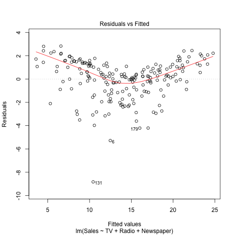

## Abstract

In this report, we reproduce the main results displayed in section 3.2 *Multiple Linear Regression* (chapter 3) of the book *[An Introduction to Statistical Learning](http://www-bcf.usc.edu/~gareth/ISL/)*.

## Introduction

The overall goal is to provide advice on how to improve sales of the particular product. More specifically, we are assessing the relationship between advertising and sales. If the analysis shows that there is an association between advertising and sales, we will develop a model to predict sales based on advertising budgets.


## Data

The [advertising dataset](http://www-bcf.usc.edu/%7Egareth/ISL/Advertising.csv) consists of Sales(in thousands of units) of a particular product in 200 different markets, along with advertising budgets (in thousands of dollars) for the product in each of those markets for three different media (TV, Newspaper and Radio).

## Methodology

Since we are studying the relationship between _Sales_ and three different media: _TV_, _Newspaper_, _Radio_, we will first run a model sales against each one of them and then try to fit a multi-linear model:

$Sales = \beta_0 + \beta_1*TV + \beta_2*Radio + \beta_3*newspaper + e$

In order to estimate four coefficients $\beta_0$, $\beta_1$, $\beta_2$ and $\beta_3$ we fit the linear regression model via the least square criterion.

## Results
```{r results= 'asis', echo = FALSE}
library(xtable)
load("../data/regression.RData")
options(xtable.comment = FALSE,
        xtable.table.placement = "H")
print(xtable(summary(Sales_over_TV), caption = "Simple Regression of Sales over TV"), type = "html")
print(xtable(summary(Sales_over_Newspaper), caption = "Simple Regression of Sales over Newspaper"), type = "html")
print(xtable(summary(Sales_over_Radio), caption = "Simple Regression of Sales over Radio"), type = "html")
```

Those 3 tables are the summary of simple linear regression for each predictor. We can see that Radio has the highest slope, which is `r format(Sales_over_Radio$coefficients[2], 2)` It suggests that spending budge on radio advertising is the most efficient. However, is this suggestion trustworthy?

We notice that p-values for these three predictors are all very small. But we ignore the correlation between them. Let's try to add all three predictors into consideration and fit a multi-line model. Below is the result.

```{r results= 'asis', echo = FALSE}
print(xtable(summary(multi_reg), caption = "Multiple Regression of Sales over TV, Radio and Newspaper"), type = "html")
```

Here we notice that the p value for Newspaper is relatively high, which suggests that the coefficient may be 0, i.e there is high chance that Newspaper budget holds a weak or even unrelated relationship with Sales. We explore this idea by looking at the correlation matrix.

```{r results= 'asis', echo = FALSE}
load("../data/correlation-matrix.RData")
print(xtable(format(cor_matrix, 4), caption = "Correlation Matrix"), type = "html")
```
We notice that the correlation between newspaper and radio is relatively high, which is `r format(cor_matrix[2, 3], 2)` This shows a high likelihood to spend budget on radio and newspaper at the same time. In a simple linear regression, we only consider the relationship between sales and a single media, which leads to a small p value. However as we run through the multi-linear model, the increase in sales brought by newspaper advertising is actually the side effect of radio advertising.

#### Is at least one of the predictors useful in predicting the response?
```{r, results='asis', echo=FALSE}
source("../code/functions/regression-functions.R")
stats <- data.frame(Statistics = c("Residual standard error", "R squared", "F-statistic"), Value = c(residual_std_error(multi_reg), r_squared(multi_reg), f_statistic(multi_reg))
)
print(xtable(stats, caption = "Table 6: RSE, R-squared and F-statistic of the least squares model"), type = "html")

```
F statistics is used in the hypothesis testing to determine whether all the coefficients are 0. As we can see in Table 6, F-statistic for our multi-linear model is `r round(stats[3,2],3)`, which indicates that at least one of the predictors is useful since if there is no relationship at all, F-statistics should be 1.

#### Do all predictors help to explain the response, or is only a subset of the predictors useful?

Only predictors with TV and Radio are useful, because the p-value for Newspaper is too high.

#### How well does the model fit the data?
If we look at R-squared in Table 6, the R-squared is `r round(stats[2,2],3)`, which is almost 1. It suggests that our model fits data pretty well. Also if we look at the residual plot, it's quite good when budget is in the middle. Too low budget or too high budget may compromise our accuracy.



# Conclusion
Through running simple linear regression and multiple linear regression, we gain more insight into this advertising dataset. We find out that newspaper budget does not have a strong relationship with sales, which is not obvious if we only run simple linear regression. And our multi-linear regression model has satisfying R square, and RSE, which means that this model fits the data pretty well. But we also notice that if budge is too low or too high, accuracy may be compromised.